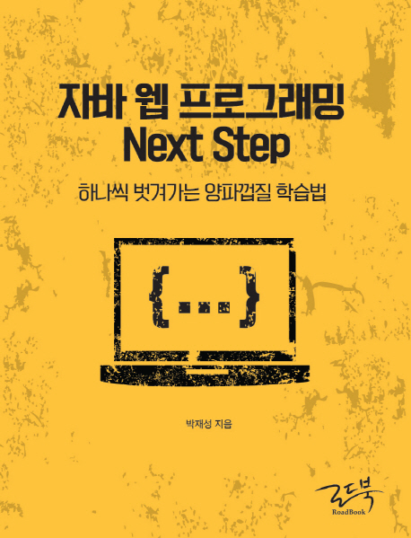

::: div row

::: div col 12|5|5|5

:::

::: div col 12|7|7|7
이 책은 웹 개발 입문의 껍질(책에서는 ‘양파껍질’로 표현한다)을 막 벗겨낸 경력 1년 이상의 초보개발자들을 대상으로 하는 책이다.

웹 서버, 프레임워크 등을 직접 제작해보고 테스트와 리팩토링을 통해 점진적 개선을 해나가면서 실무에 필요한 개발 능력과 웹에 대한 폭넓은 이해력을 높여준다.

10년 이상 자바 웹 프로그래머로 살아온 저자의 경험과, 3년 이상 NEXT에서 웹 서버 전공으로 학생들을 가르치면서 얻게 된 ‘학습’과 관련된 생각을 ‘양파껍질 학습법’이라는 저자만의 독특한 접근법으로 정리한 책이다.

:::

:::

### 책 키워드

자바지기
백엔드 개발자
초보 개발자
자바 웹 프로그래밍
자바 웹 서버
스프링 프레임워크
테스트
리팩토링
의존관계 주입

## 출판사 서평

대상 독자

`[가장 읽기에 적합한 대상독자]`

1. 실무에서 스프링 프레임워크 기반으로 자바 웹 프로그래밍을 하고 있는 개발자로 내부 기술의 동작 원리를 학습하고 싶은 개발자. 경력으로 본다면 최소 1년 이상의 경험을 가진 자바 웹 개발자.
2. 다른 개발자가 구현해 놓은 라이브러리, 프레임워크를 사용만 하는 것이 아니라 본인이 직접 라이브러리와 프레임워크를 구현하는 경험을 하고 싶은 개발자. 라이브러리와 프레임워크를 구현하면서 테스트, 리팩토링, 객체지향 설계 연습을 하고 싶은 개발자.
3. 필자의 학습 방식과 자신의 학습 방식을 비교해 보면서 새로운 학습 방식을 찾고 싶은 개발자. 학습 방식을 비교해 보면서 자신의 현재 상태를 점검하고 부족한 부분을 찾아 다음 단계의 학습 로드맵을 설계하고 싶은 개발자.

`[다음 단계로 적합한 대상 독자]`

1. 이미 파이썬, 루비, PHP 기반으로 웹 프로그래밍을 해본 경험이 있는 개발자로 자바 기반의 웹 개발자로 전향하고 싶은 개발자. 자바 웹 개발자로 성장하기 위해 학습해야 할 지식과 로드맵을 찾고 있는 개발자.
2. 웹 프로그래밍 경험은 없지만 C, C++ 등의 프로그래밍 경험이 있는 개발자로 자바 기반 웹 개발자로 전향하고 싶은 개발자.

**새로운 프로그래밍 학습법을 제시한다!**

이 책은 일방적으로 지식을 전달하기 위한 책이 아니다. 책을 읽는 독자가 직접 무엇인가를 구현해 가면서 이와 관련한 지식을 학습하는 방식으로 구성되어 있다. 그렇다고 아무것도 없는 상태에서 무엇인가를 구현하라고 요구하는 것이 아니라, “요구사항 〉 힌트 〉 구현 〉 점진적 개선”이라는 학습 과정을 통해 혼자 힘으로 문제를 해결할 수 있도록 도움을 주고 있다.

누구나 아무것도 없는 상태에서 무엇인가를 구현하라고 하면 경험이 없는 상태에서는 두려움이 앞서 시도조차 하지 않는 경우가 많다. 이 책은 두려움보다는 문제를 해결해 가면서 자신감을 얻고, 성공의 맛을 느낄 수 있도록 설계된 책이다.

`[주요 내용]`

1장은 프로그래밍을 처음 시작하는 개발자가 첫 번째 단계를 극복하기 위해 참고할 내용에 대해 다룬다.

2장은 문자열 계산기 구현을 통해 테스트와 리팩토링의 중요성에 대해 다룬다.

3장, 4장은 HTTP 웹 서버를 직접 구현하는 경험을 한다. 웹 클라이언트와 웹 서버가 HTTP를 통해 데이터를 어떻게 주고 받는지를 이해할 수 있다.

5장은 앞에서 구현한 HTTP 웹 서버를 리팩토링하는 경험을 한다.

6장은 세션을 직접 구현해보고 MVC 프레임워크 초기 버전을 구현하는 경험을 한다. 세션과 MVC 패턴에 대한 이해도를 높이고 있다.

7장은 JDBC API를 사용하는 과정에서 발생하는 중복 코드를 리팩토링을 통해 제거하고, 공통 라이브러리를 구현하는 경험을 한다.

8장은 AJAX를 지원하기 위해 JSON API를 제공하는 과정을 다룬다. 새로운 기능을 추가하기 위해 객체지향 설계와 개발이 가지는 의미에 대해 다룬다.

9장은 지금까지 학습한 과정을 제대로 이해했는지 검토하기 위해 자체 점검을 진행한다. 자신이 부족한 부분을 파악하고, 다음 단계를 위한 준비 단계로 삼는다.

10장은 지금까지 구현한 MVC 프레임워크의 부족한 부분을 찾아 개선하는 경험을 한다.

11장, 12장은 싱글톤 패턴 기반 개발의 한계점을 파악하고, 이를 개선하기 위해 의존관계 주입(Dependency Injection, 이하 DI)을 지원하는 프레임워크를 구현하는 경험을 한다.

13장은 지금까지의 학습 단계를 넘어 다음 단계로 학습할 주제와 각 주제별로 참고할 자료들을 공유하는 것으로 책을 마무리한다.

## 저자소개

`저자 박재성`은 프로그래밍을 통해 지속 가능한 삶을 살아가는 것에 관심이 많다. 최근에는 대한민국에서 자신의 색깔을 유지하며 행복한 삶을 살아가는 방법을 주변에 전하는 데 더 많은 관심을 가지고 있다. [SLIPP](HTTPS://SLIPP.NET) 커뮤니티를 통해 다른 개발자와 온라인으로 소통하고, 오프라인 스터디를 통해 다양한 개발자들과 교류하고 있다. 저서로는 `〈자바 세상의 빌드를 이끄는 메이븐〉(2011, 한빛미디어)`, `프로그래머 그 다음 이야기(2011)`가 있다.

저자는 현재 NEXT INSTITUTE에서 웹 서버 전공 학생들에게 자바 웹 프로그래밍을 가르치면서 사람을 키우는 즐거움을 느끼고 있다. 나와 같은 반란군을 키우는 교육자이고 싶다.

## 목차

1장. 첫 번째 양파 껍질 벗기기 
1.1 대한민국 IT 개발자 직군의 종류 
1.2 개발자들에게 유용한 웹사이트들 
1.3 처음에 배워야 하는 것들 
1.4 일단 시작해 보자 
1.5 본격적으로 웹 프로그래밍에 도전하기 
1.6 학습 방법 

두 번째 양파 껍질 벗기기

2장 문자열 계산기 구현을 통한 테스트와 리팩토링 
2.1 main() 메소드를 활용한 테스트의 문제점 
2.2 JUnit을 활용해 main() 메소드 문제점 극복 
2.3 문자열 계산기 요구사항 및 실습 
2.4 테스트와 리팩토링을 통한 문자열 계산기 구현 
2.5 추가 학습 자료 

3장 개발 환경 구축 및 웹 서버 실습 요구사항 
3.1 서비스 요구사항 
3.2 로컬 개발 환경 구축 
3.3 원격 서버에 배포 
3.4 웹 서버 실습 
3.5 추가 학습 자료 

4장 HTTP 웹 서버 구현을 통해 HTTP 이해하기 
4.1 동영상을 활용한 HTTP 웹 서버 실습 
4.2 HTTP 웹 서버 구현 
4.3 추가 학습 자료 

5장 웹 서버 리팩토링, 서블릿 컨테이너와 서블릿의 관계 
5.1 HTTP 웹 서버 리팩토링 실습 
5.2 웹 서버 리팩토링 구현 및 설명 
5.3 서블릿 컨테이너, 서블릿/JSP를 활용한 문제 해결 
5.4 추가 학습 자료 

6장 서블릿/JSP를 활용해 동적인 웹 애플리케이션 개발하기 
6.1 서블릿/JSP로 회원관리 기능 다시 개발하기 
6.2 세션(HttpSession) 요구사항 및 실습 
6.3 세션(HttpSession) 구현 
6.4 MVC 프레임워크 요구사항 1단계 
6.5 MVC 프레임워크 구현 1단계 
6.6 쉘 스크립트를 활용한 배포 자동화 
6.7 추가 학습 자료 

7장 DB를 활용해 데이터를 영구적으로 저장하기 
7.1 회원 데이터를 DB에 저장하기 실습 
7.2 DAO 리팩토링 실습 
7.3 동영상을 활용한 DAO 리팩토링 실습 
7.4 DAO 리팩토링 및 설명 
7.5 추가 학습 자료 

8장 AJAX를 활용해 새로고침 없이 데이터 갱신하기 
8.1 질문/답변 게시판 구현 
8.2 AJAX 활용해 답변 추가, 삭제 실습 
8.3 MVC 프레임워크 요구사항 2단계 
8.4 MVC 프레임워크 구현 2단계 
8.5 추가 학습 자료 

9장 두 번째 양파 껍질을 벗기기 위한 중간 점검 
9.1 자체 점검 요구사항(필수) 
9.2 자체 점검 요구사항(선택) 
9.3 자체 점검 확인 

10장 새로운 MVC 프레임워크 구현을 통한 점진적 개선 
10.1 MVC 프레임워크 요구사항 3단계 
10.2 MVC 프레임워크 구현 3단계 
10.3 인터페이스가 다른 경우 확장성 있는 설계 
10.4 배포 자동화를 위한 쉘 스크립트 개선 

11장 의존관계 주입(이하 DI)을 통한 테스트하기 쉬운 코드 만들기 
11.1 왜 DI가 필요한가? 
11.2 DI를 적용하면서 쌓이는 불편함(불만) 
11.3 불만 해소하기 
11.4 DI 프레임워크 실습 
11.5 DI 프레임워크 구현 
11.6 추가 학습 자료 

12장 확장성 있는 DI 프레임워크로 개선 
12.1 필드와 setter 메소드에 @Inject 기능 추가 
12.2 필드와 setter 메소드 @Inject 구현 
12.3 @Inject 개선 
12.4 설정 추가를 통한 유연성 확보 
12.5 외부 라이브러리 클래스를 빈으로 등록하기 
12.6 초기화 기능 추가 
12.7 인터페이스, DI, DI 컨테이너 
12.8 웹 서버 도입을 통한 서비스 운영 

13장 세 번째 양파 껍질 벗기기 
13.1 스프링과 ORM 프레임워크 
13.2 성능과 보안 
13.3 프론트엔드 학습 
13.4 설계, 테스트, 리팩토링 
13.5 빌드, 배포 자동화 및 지속적 통합 
13.6 개발 문화 및 프로세스 학습 

## 책 정보

|        |               |
| ------ | :-----------: |
| 저자   |    박재성     |
| 출판사 |    로드북     |
| 출간일 |  2016.09.19   |
| ISBN   | 9788997924240 |
| 쪽수   |     480쪽     |
| 크기   | 174x225x25mm  |
| 무게   |     758g      |
